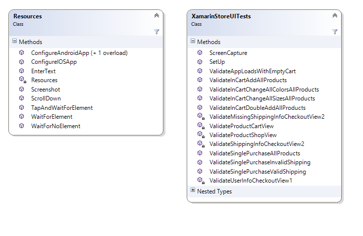
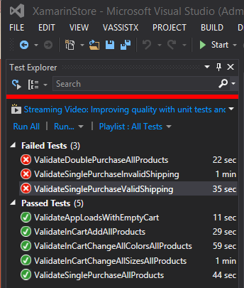
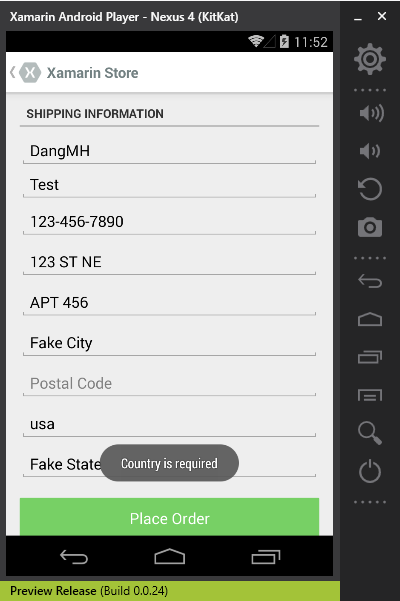
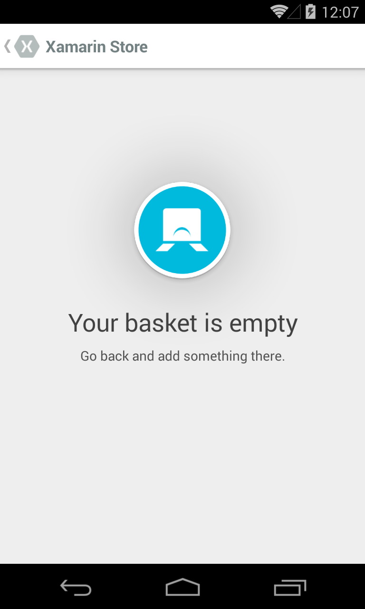
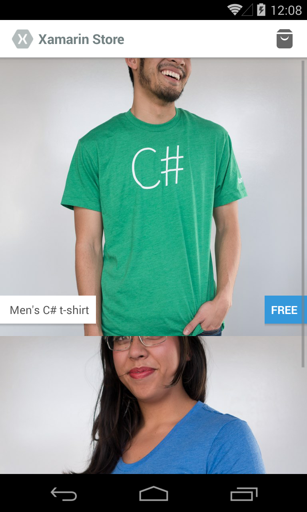
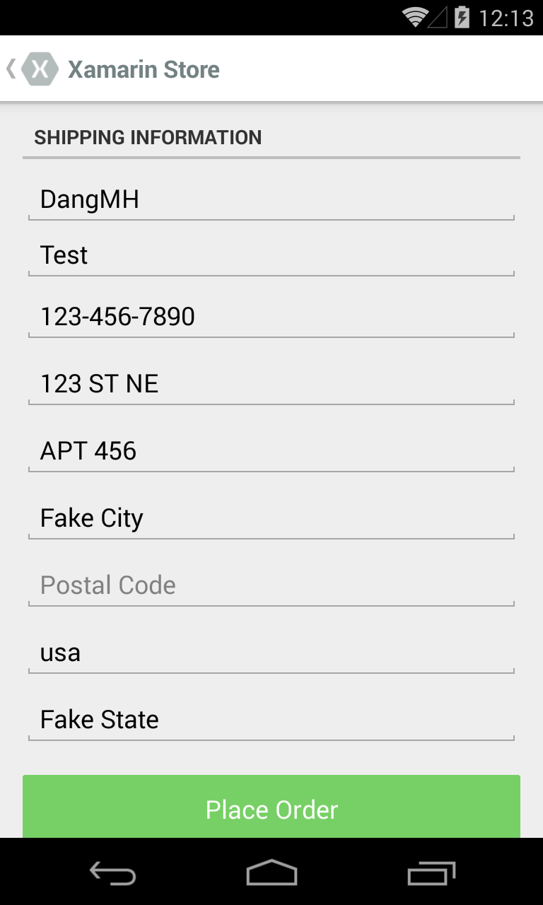

Xamarin Store App UI Automation
================
Summary  
----------------
●	Write a Calabash script that navigates through the app and tests that each page is working as it should 
 
●	Script would automate both success cases, like form being filled out correctly, and failure cases such as incorrect input correctly identified as such  

●	Bonus: Write the tests in UITest, which is a Calabash-compatible test framework meant for NUnit and C# testing.  

Setup  
----------------
1.	Fork the xamarin-store-app repo (1)  

2.	Successfully run the app on on either Android or iOS simulator (latter should be easiest)  

3.	Add support for the following individual tests using Calabash or UITest for the platform of your choice:  

    a.	Check that the app loads with the cart empty  
    b.	Successfully adding an item to the cart  
    c.	Changing the size of an item in the cart  
    d.	Completing an Order with a single item in the cart  
    e.	Confirm entering invalid shipping information shows the right error on screen  
    f.	Confirm entering valid shipping information lets you proceed  

Links  
----------------
●	[Xamarin Store GitHub Repository](https://github.com/xamarin/xamarin-store-app)  
●	[Calabash](https://components.xamarin.com/view/calabash/)  

SOLUTION
----------------
Written in Visual Studio 2013

###Files
- **<a href="XamarinStoreUITests.cd">XamarinStoreUITests.cd</a>**: Class diagram of the XamarinStoreUITests  
- **<a href="XamarinStoreUITests.cs">XamarinStoreUITests.cs</a>**: Class containing the UI Test logic, platform agnostic  
- **<a href="Resources.cs">Resources.cs</a>**: Class holding UI Test resources and macros.  

###Installation

- Download the repository locally  

- Open the .sln file in Visual Studio 2013  

- Insert email into the Xamarin app LoginFragment.cs file for Android or LoginViewController.cs for iOS  

- Populate the Resources TEST\_ACCOUNT\_EMAIL and TEST\_ACCOUNT\_PASSWORD with the appropriate Xamarin account information  

###Design
Essentially I wanted to create a _robust_ test framework that increased _readability_ and _reduced redundant code_.  There were many instances of UI functionality I wished I had (Scrolling down until an element showed for multipage views, navigating to another view and confirming the view is displayed, etc.) and macros that condensed redundant code (try waiting for an element before catching the exception and asserting failure, queries for specific elements).  The **Resources** class held those macros (which can be used for any set of UI tests) as well as assets (source and app filepaths) and queries specific to the Xamarin Store.

The **XamarinStoreUITests** class can then leverage the **Resources** class at will throughout its tests.  The public interface reveals the _scenarios_ and _use cases_ for the app.  The private interface is the framework that the set of tests can leverage for element validation as well as other functional testing.  Using _Xamarin's_ **IApp** interface, the tests are platform agnostic and will run against both _iOS_ apps and _Android_ apps (and possibly _Windows Phone_ apps in the future).

All UI tests will also screen capture at test completion (success or failure) and will have tagged and ordered files created per test.

  

###Results
Here is a set of example run times and result of the latest test pass:  

  

At the time of this submission there are 3 failures:  

1. **ValidateDoublePurchaseAllProducts**  
*_refactored to ValidateInCartDoubleAddAllProducts_  
This test was created from a bug found when manually play-testing the Xamarin Store app.  At the time of failure, the app was having issues when 2 of the same item to the cart (i.e., 2 men's shirts and/or 2 women's shirts), regardless of size or color.  When the cart contains the previous case, any item that is removed will remove the item following it in the cart as well.  If it is the item at the end of the cart, the app freezes, switches views back to the phone home and sends XamarinStore into the background.  

2. **ValidateSinglePurchaseInvalidShipping**  
This test has uncovered another bug at time of development.  When the text fields are set correctly and missing the zipcode, the presented error code when the order is finalized is _"Country is required"_ instead of the expected _"Zipcode is required"_.  
  
3. **ValidateSinglePurchaseValidShipping**
This code has the valid shipping info population logic and finalize order logic commented out as the app only allows one shirt order to account.  Until the logic to allow infinite orders is allowed, this code will only run once before failing due to the servers denying further orders.

###Example Result Screenshots

**ValidateAppLoadsWithEmptyCart-Success0.png**  
  

**ValidateInCartAddAllProducts-Success0.png**  

**ValidateSinglePurchaseInvalidShipping-Error0.png**  

